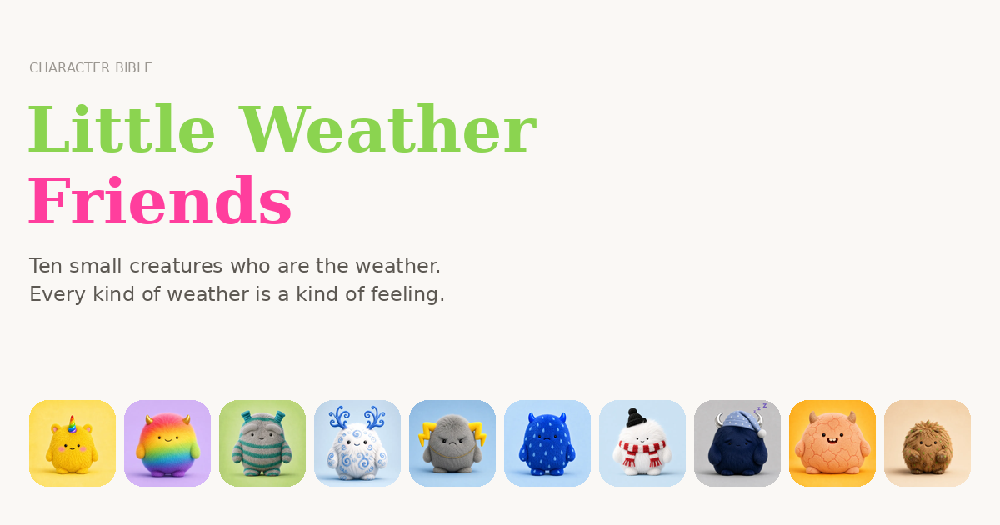

# Little Weather Friends

Character bible for a pre-school property. Ten small creatures who *are* the weather — each one carrying a feeling children already know but cannot always name.

**Live:** https://jarrydz.github.io/little-weather-friends/



## The cast

| # | Character | Element | Feeling | Role |
|---|-----------|---------|---------|------|
| 01 | Sunny Sunshine | Sunshine | Joy | The warm one |
| 02 | Joyful Rainbow | Light after rain | Hope | The one who arrives after |
| 03 | Cheeky Tornado | Whirlwind | Mischief | The trouble |
| 04 | Swirly Wirly Wind | Wind | Restlessness | The traveller |
| 05 | Grumpy Thunderbolt | Thunder | Anger | The loud one |
| 06 | Sad Raindrop | Rain | Sadness | The soft one |
| 07 | Snowy Snowman | Snow | Calm | The quiet one |
| 08 | Sleepy Moon | Night | Tiredness | The keeper of endings |
| 09 | Dusty Drought | Drought | Longing | The one who waits |
| 10 | Mr Muddy | Mud | Play | The mess |

## The idea

Weather as feelings. The cast has cause and effect built in, which gives episodes their shape:

- Sunny, kind for too many days → **Dusty Drought**
- Sunny **and** Sad Raindrop in the same sky → **Joyful Rainbow**
- Sad Raindrop, once it passes → **Mr Muddy**
- Sleepy Moon closes every story

Sad Raindrop is the emotional centre. Nobody tells Raindrop to cheer up — the others sit with it. That is the differentiator against every other weather-mascot property, which defaults to relentless sunshine.

## Repo layout

```
index.html        the site — grid home page, one-pager per character
images/           web-optimised WebP renders (1200px hero, 600px thumb)
characters/       master PNG renders, named and unnamed variants
standalone.html   the whole site in one file, images inlined — works offline
og-card.png       social share card
```

## Running it

No build step, no dependencies. Open `index.html` over HTTP:

```bash
python3 -m http.server 8000
```

Then visit http://localhost:8000. Opening the file directly with `file://` also works, though some browsers restrict local image loading — `standalone.html` has no such problem.

## Notes

- Type is Instrument Serif + Inter, loaded from Google Fonts, with local serif/sans fallbacks.
- Transitions are hand-rolled FLIP using the Web Animations API — the grid image physically flies into the detail hero and back. No framework.
- `prefers-reduced-motion` is respected; deep links (`#sad-raindrop`) work; Esc and arrow keys are wired up.
- Masthead colours are two CSS variables at the top of the file: `--green` and `--pink`.

## Deploying

GitHub Pages, `main` branch, `/ (root)`. `.nojekyll` is present so Pages serves files as-is.
